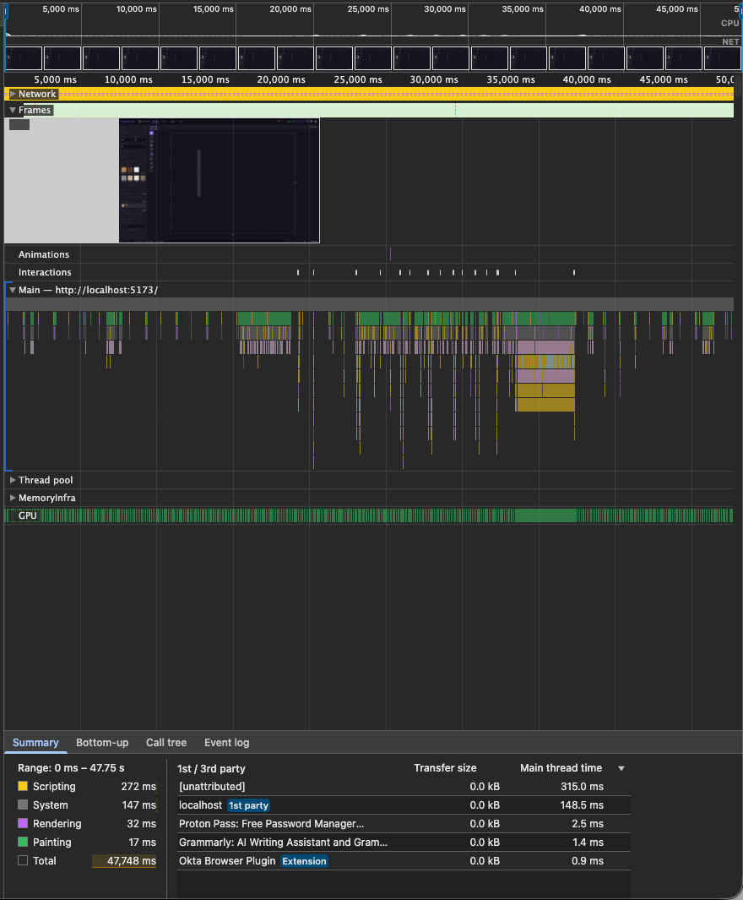

<objective>
Run the evidence bundle required by D-10 and close Phase 25. This is a verification plan — one human-in-the-loop checkpoint produces the Chrome DevTools trace and the `window.__cadBench()` before/after numbers; Claude assembles them into 25-VERIFICATION.md and updates ROADMAP.

Purpose: Phase 24 established the manual-evidence verification style (D-12 carries it forward). The 60fps assertion and the 2x snapshot ratio are not measurable in jsdom; they require Chrome DevTools + a real dev server. One checkpoint captures both.
Output: `25-VERIFICATION.md` with trace + bench numbers + ratio computation + regression confirmation; ROADMAP updated to mark Phase 25 complete.
</objective>

<execution_context>
@$HOME/.claude/get-shit-done/workflows/execute-plan.md
@$HOME/.claude/get-shit-done/templates/summary.md
</execution_context>

<context>
@.planning/phases/25-canvas-store-performance/25-CONTEXT.md
@.planning/phases/25-canvas-store-performance/25-RESEARCH.md
@.planning/phases/25-canvas-store-performance/25-VALIDATION.md
@.planning/phases/25-canvas-store-performance/25-00-SUMMARY.md
@.planning/phases/25-canvas-store-performance/25-01-SUMMARY.md
@.planning/phases/25-canvas-store-performance/25-02-SUMMARY.md
@.planning/ROADMAP.md
@.planning/REQUIREMENTS.md

<interfaces>
<!-- The 5 ROADMAP success criteria for Phase 25 (must all be addressed in VERIFICATION.md): -->
<!-- 1. 60fps drag at 50 walls / 30 products (no frame > 16.7ms) — Chrome DevTools trace -->
<!-- 2. structuredClone replaces every JSON.parse(JSON.stringify) in cadStore.ts snapshot() -->
<!-- 3. Snapshot ≥ 2x faster at 50 walls / 30 products — __cadBench ratio -->
<!-- 4. Undo/redo single history entry per drag — Wave 0 contract tests (auto-verified) -->
<!-- 5. All tests pass with identical visual output — full suite regression -->

<!-- Dev helpers available from 25-00 (Wave 0 installed these): -->
<!--   window.__cadSeed(50, 30)  → seeds canonical benchmark scene -->
<!--   window.__cadBench(100)    → runs 100 snapshots, logs mean + p95 -->
</interfaces>
</context>

<tasks>

<task type="auto">
  <name>Task 1: Capture bench BEFORE baseline from the pre-Wave-1 JSON codepath</name>
  <files>.planning/phases/25-canvas-store-performance/25-VERIFICATION.md (created here)</files>
  <read_first>
    - .planning/phases/25-canvas-store-performance/25-CONTEXT.md (D-10, D-11 — evidence bundle contract)
    - .planning/phases/25-canvas-store-performance/25-01-SUMMARY.md (any before-number already captured during Wave 1)
    - .planning/phases/24-tool-architecture-refactor/24-04-SUMMARY.md (Phase 24 verification format — match that shape)
  </read_first>
  <action>
    The BEFORE numbers capture the JSON.parse(JSON.stringify) snapshot baseline. Two acceptable sources (planner picks whichever 25-01-SUMMARY.md captured):

    Option A — reuse numbers already in 25-01-SUMMARY.md. If Wave 1 captured them, reference them here verbatim.

    Option B — if no BEFORE baseline exists in SUMMARY files, reconstruct now:
    1. Create throwaway branch: `git switch -c phase-25-bench-before HEAD~N` where N is the Wave 1 commit depth. (Do NOT commit on this branch; it's for measurement only.)
    2. `npm run dev` → open http://localhost:5173
    3. DevTools console: `window.__cadSeed(50, 30)` — confirm returns `{walls: 50, products: 30}`
    4. `window.__cadBench(100)` three times; record mean + p95 from each run. Use the median of the three runs as the BEFORE baseline.
    5. `git switch -` back to the feature branch. No artifacts committed.

    Record the result in a stub `.planning/phases/25-canvas-store-performance/25-VERIFICATION.md` under a `## PERF-02 — Snapshot Benchmark` heading:

    ```markdown
    ## PERF-02 — Snapshot Benchmark

    ### BEFORE (JSON.parse(JSON.stringify) — pre-Wave-1)

    Captured: <date>
    Machine: <Micah's M-series Mac>
    Seed: `window.__cadSeed(50, 30)` → 50 walls, 30 products
    Runs: 3× `window.__cadBench(100)`, median reported

    | Metric | Value |
    |--------|-------|
    | Mean (ms) | <X.XX> |
    | p95 (ms)  | <Y.YY> |
    | Source    | `[cadStore] snapshot ...` console output |

    ### AFTER
    (populated by Task 2)
    ```

    If Option A (numbers already in 25-01-SUMMARY): copy them into this file and reference the source SUMMARY.
  </action>
  <verify>
    <automated>test -f .planning/phases/25-canvas-store-performance/25-VERIFICATION.md && grep -q "BEFORE" .planning/phases/25-canvas-store-performance/25-VERIFICATION.md</automated>
  </verify>
  <acceptance_criteria>
    - `.planning/phases/25-canvas-store-performance/25-VERIFICATION.md` exists
    - File contains the literal string `BEFORE`
    - File contains a numeric mean value (regex-matchable: `Mean.*\d+\.\d+`)
    - File contains the seed line `window.__cadSeed(50, 30)`
  </acceptance_criteria>
  <done>
    VERIFICATION.md stub exists with BEFORE baseline (mean + p95) for snapshot at 50W/30P scene.
  </done>
</task>

<task type="checkpoint:human-verify" gate="blocking">
  <name>Task 2: Human captures AFTER bench numbers + Chrome DevTools Performance trace</name>
  <files>.planning/phases/25-canvas-store-performance/25-perf-trace.png (screenshot to be saved)</files>
  <action>
    This is a human-in-the-loop checkpoint. Claude pauses here, surfaces the `<how-to-verify>` instructions to the user, and waits for the `<resume-signal>` (pasted bench output + frame count + regression summary + smoke pass/fail).

    Claude does NOT run any automation in this task — Chrome DevTools Performance panel and the dev-server browser are required, and are only available to the human operator. After the user replies with the evidence, execution resumes at Task 3 which assembles it into VERIFICATION.md.
  </action>
  <what-built>
    Wave 1 landed `structuredClone` in cadStore.snapshot(). Wave 2 landed the drag fast path with `renderOnAddRemove: false` and closure-scoped pre-drag cache with cleanup revert. This task captures the two manual-evidence artifacts required by D-10.
  </what-built>
  <how-to-verify>
    **Part A — PERF-02 snapshot bench (~2 minutes):**
    1. Open terminal: `npm run dev`
    2. Browser: http://localhost:5173
    3. Open DevTools → Console tab
    4. Run: `window.__cadSeed(50, 30)` → must return `{walls: 50, products: 30}`
    5. Run: `window.__cadBench(100)` — capture the console output (mean + p95)
    6. Run it TWO MORE TIMES. Report the median of the three runs as the AFTER value.
    7. Paste the three console outputs into the checkpoint resume message.

    **Part B — PERF-01 drag performance trace (~5 minutes):**
    1. Same dev server + 50/30 seeded scene.
    2. DevTools → Performance tab → click Record (●)
    3. On canvas: click a product, DRAG it across the canvas smoothly for ~5 seconds (don't release until done)
    4. Release mouse, then click Stop (■) in Performance tab
    5. In the Frames lane: count frames > 16.7ms in the dragging region. TARGET = 0.
    6. Screenshot the trace (full Performance tab view, Frames lane visible). Save to `.planning/phases/25-canvas-store-performance/25-perf-trace.png`.
    7. Report: frames-over-16.7ms count, and screenshot path.

    **Part C — Regression sanity (~10 seconds):**
    1. Terminal: `npm test`
    2. Confirm: 168 pre-existing passing still pass; new green count ≥ 4 (Wave 0's 4 contract tests flipped); failures unchanged at 6; todo unchanged at 3.
    3. Report the full suite summary line.

    **Part D — Single-undo smoke (~30 seconds):**
    1. Drag a product; release; Ctrl+Z — confirm ONE undo step returns it.
    2. Drag a wall endpoint; release; Ctrl+Z — confirm ONE undo step returns it.
    3. Rotate a product via handle; release; Ctrl+Z — confirm ONE undo step returns it.
    4. Start a drag; press `W` mid-drag; confirm snap-back; Ctrl+Z — confirm NOTHING to undo.
    5. Report: pass/fail for each.
  </how-to-verify>
  <resume-signal>
    Paste back:
    - Three `window.__cadBench(100)` console outputs from Part A
    - Frames-over-16.7ms count from Part B + confirmation that 25-perf-trace.png was saved
    - `npm test` summary line from Part C
    - Pass/fail for each sub-step of Part D
    OR type "verified" if all pass with defaults, plus raw bench numbers.
  </resume-signal>
  <verify>
    <automated>test -f .planning/phases/25-canvas-store-performance/25-perf-trace.png</automated>
  </verify>
  <acceptance_criteria>
    - User has pasted back bench numbers (mean + p95 for three runs of `window.__cadBench(100)` on a 50W/30P seeded scene)
    - User has reported frames-over-16.7ms count from Chrome DevTools Performance trace
    - File `.planning/phases/25-canvas-store-performance/25-perf-trace.png` exists on disk
    - User has confirmed `npm test` shows 168 pre-existing passing preserved + ≥4 new green from Wave 0 contract tests flipping
    - User has reported pass/fail for each of the 4 single-undo smoke scenarios (product drag, wall endpoint drag, product rotation, interrupted drag)
  </acceptance_criteria>
  <done>
    User has supplied: three __cadBench outputs, frame-drop count, regression summary line, single-undo pass/fail grid. Trace screenshot saved to disk. Ready for Task 3 to assemble evidence bundle.
  </done>
</task>

<task type="auto">
  <name>Task 3: Assemble 25-VERIFICATION.md evidence bundle + update ROADMAP</name>
  <files>
    .planning/phases/25-canvas-store-performance/25-VERIFICATION.md,
    .planning/ROADMAP.md
  </files>
  <read_first>
    - .planning/phases/25-canvas-store-performance/25-VERIFICATION.md (the in-progress stub from Task 1)
    - Checkpoint resume message from Task 2 (bench numbers, trace result, regression confirmation, single-undo smoke)
    - .planning/ROADMAP.md (current Phase 25 entry: lines 82-92 currently show "Phase 25 — Not started")
    - .planning/phases/24-tool-architecture-refactor/24-04-SUMMARY.md (match the Phase 24 SUMMARY style for the Phase 25 close-out)
  </read_first>
  <action>
    **Part A — Populate 25-VERIFICATION.md:**

    Extend the stub with the AFTER numbers + ratio + PERF-01 section + regression + success-criteria matrix. Target structure:

    ```markdown
    # Phase 25 — Canvas & Store Performance · VERIFICATION

    **Verified:** <date>
    **Verifier:** Human-in-the-loop (Micah)
    **Outcome:** PASS / FAIL

    ## ROADMAP Success Criteria Matrix

    | # | Criterion | Status | Evidence |
    |---|-----------|--------|----------|
    | 1 | 60fps drag at 50W/30P (no frame > 16.7ms) | ✅/❌ | Chrome trace, <N> frames over budget |
    | 2 | structuredClone replaces every JSON.parse(JSON.stringify) in snapshot() | ✅ | grep: 0 JSON.parse in snapshot() body |
    | 3 | Snapshot ≥ 2x faster at 50W/30P | ✅/❌ | ratio = <X>/<Y> = <R>× |
    | 4 | Undo/redo single history entry per drag | ✅ | Wave 0 tests pass + smoke confirmed |
    | 5 | All tests pass with identical visual output | ✅ | 168 pre-existing passing preserved; 4 new green |

    ## PERF-02 — Snapshot Benchmark

    ### BEFORE (from Task 1)
    | Mean | p95 |
    |------|-----|
    | <X.XX> ms | <Y.YY> ms |

    ### AFTER (from Task 2 Part A — median of 3 runs)
    | Mean | p95 |
    |------|-----|
    | <A.AA> ms | <B.BB> ms |

    ### Ratio
    Mean ratio: <X.XX> / <A.AA> = **<R.RR>×**
    Target: ≥ 2.0× — **<PASS/FAIL>**

    ## PERF-01 — Drag Performance Trace

    **Scene:** `window.__cadSeed(50, 30)` — 50 walls, 30 products
    **Gesture:** Product drag across canvas, ~5 seconds
    **Trace file:** `25-perf-trace.png`

    - Frames > 16.7ms in dragging region: **<N>**
    - Target: 0 — **<PASS/FAIL>**

    

    ## Regression Confirmation

    `npm test` output (from Task 2 Part C):
    ```
    <paste summary line>
    ```

    Baseline: 168 passing / 6 pre-existing failing / 3 todo → preserved. New green from Phase 25 Wave 0 contracts: <count>.

    ## Single-History-Entry Smoke (Task 2 Part D)

    - [ ] Product drag → 1 undo returns it
    - [ ] Wall endpoint drag → 1 undo returns it
    - [ ] Product rotation → 1 undo returns it
    - [ ] Interrupted drag (tool switch) → nothing to undo (revert only, no history push)

    ## Out-of-Scope Confirmation

    Per D-07, the following JSON.parse(JSON.stringify) calls were INTENTIONALLY left in place and are NOT regressions:
    - `src/stores/cadStore.ts` copyWallSide: lines ~810, 817, 824, 834 (4 total)
    - `src/App.tsx` clone calls: lines ~144, 145, 176-178 (5 total)
    These are single-user-action paths, not hot paths, and scoped out of PERF-02.

    ## Decisions Honored

    D-01 ✅ Drag-only fast path (not object pool)
    D-02 ✅ renderOnAddRemove: false
    D-03 ✅ 4 drag types: product move, wall move, wall endpoint, product rotation
    D-04 ✅ Non-moving layers not re-rendered during drag
    D-05 ✅ Zero store writes during drag; one commit on mouseup
    D-06 ✅ Cleanup revert wired
    D-07 ✅ structuredClone for rooms + customElements + customPaints
    D-08 ✅ Cloning preserved (not skipped)
    D-09 ✅ Dev-gated snapshot timing + __cadBench helper
    D-10 ✅ Evidence bundle: trace + bench numbers (this file)
    D-11 ✅ Canonical 50W/30P seed via __cadSeed
    D-12 ✅ Manual-evidence verification (no brittle CI perf asserts)
    ```

    Fill every placeholder from the resume-signal content.

    **Part B — Update ROADMAP.md:**

    In `.planning/ROADMAP.md`, edit the Phase 25 entry (currently around lines 82-92):

    1. Change `- [ ] **Phase 25: Canvas & Store Performance**` to `- [x] **Phase 25: Canvas & Store Performance**` and append ` (shipped <date>)`
    2. Under Phase 25's `**Plans**: TBD`, replace with the 4-plan list:
       ```markdown
       **Plans**: 4 plans
         - [x] 25-00-wave0-validation-scaffolding-PLAN.md — 7 RED tests + window.__cadSeed/__cadBench dev helpers
         - [x] 25-01-wave1-structured-clone-PLAN.md — snapshot() uses structuredClone (PERF-02)
         - [x] 25-02-wave2-drag-fast-path-PLAN.md — drag fast path + renderOnAddRemove: false (PERF-01)
         - [x] 25-03-wave3-verification-PLAN.md — evidence bundle + ROADMAP update
       ```
    3. Update the Progress Table row for Phase 25 to `4/4 | Complete | <date>`.
    4. Do NOT touch Phase 26 / 27 entries.

    **Part C — commit:**
    ```bash
    node "$HOME/.claude/get-shit-done/bin/gsd-tools.cjs" commit "docs(phase-25): complete phase verification (PERF-01 + PERF-02)" --files .planning/phases/25-canvas-store-performance/25-VERIFICATION.md .planning/phases/25-canvas-store-performance/25-perf-trace.png .planning/ROADMAP.md
    ```

    Implements: D-10, D-12. Closes Phase 25.
  </action>
  <verify>
    <automated>grep -q "structuredClone" .planning/phases/25-canvas-store-performance/25-VERIFICATION.md && grep -q "ratio" .planning/phases/25-canvas-store-performance/25-VERIFICATION.md && grep -q "\[x\] \*\*Phase 25" .planning/ROADMAP.md</automated>
  </verify>
  <acceptance_criteria>
    - `.planning/phases/25-canvas-store-performance/25-VERIFICATION.md` contains the literal string `structuredClone`
    - `25-VERIFICATION.md` contains the literal string `ratio` and a numeric ratio value matching `\d+\.\d+×?`
    - `25-VERIFICATION.md` contains `✅` or `❌` in the Success Criteria Matrix for all 5 criteria
    - `25-VERIFICATION.md` contains a reference to `25-perf-trace.png` (markdown image link)
    - `.planning/ROADMAP.md` Phase 25 entry begins with `- [x] **Phase 25:` (checkbox marked complete)
    - `.planning/ROADMAP.md` Progress Table row for Phase 25 shows `4/4` and `Complete`
    - `.planning/ROADMAP.md` Phase 25 Plans block lists all four SUMMARY PLAN files with `[x]`
    - Commit is visible in `git log -1 --name-only` listing VERIFICATION.md + 25-perf-trace.png + ROADMAP.md
    - `npm test` full suite still green against the 168/6/3 baseline + Phase 25 new green count
  </acceptance_criteria>
  <done>
    25-VERIFICATION.md holds the PERF-01 trace reference + PERF-02 bench ratio + success criteria matrix + regression confirmation. ROADMAP.md shows Phase 25 as `[x]` with all 4 plans listed. Commit landed. Phase 25 is closed.
  </done>
</task>

</tasks>

<verification>
- `25-VERIFICATION.md` populated with all 5 ROADMAP success criteria marked ✅ (or ❌ with remediation note)
- Snapshot mean ratio ≥ 2.0×
- Chrome trace shows zero frames > 16.7ms during drag region
- Full `npm test`: 168 pre-existing passing preserved; 4 new green from Wave 0 contracts
- ROADMAP.md marks Phase 25 complete; Progress Table updated to 4/4

If ratio < 2.0× or drag trace shows dropped frames: escalate to a gap-closure Wave 4, do NOT mark Phase 25 complete. Per D-12, we ship on manual evidence — but only if evidence is green.
</verification>

<success_criteria>
- [ ] `25-VERIFICATION.md` exists with PERF-01 trace reference + PERF-02 bench ratio + regression confirmation
- [ ] Snapshot ratio ≥ 2.0× documented
- [ ] Zero frames > 16.7ms during drag documented
- [ ] ROADMAP.md Phase 25 marked `[x]` complete with all 4 plans listed
- [ ] STATE.md reflects Phase 25 complete status (if the commit doesn't auto-update it, update manually or note for next session)
- [ ] Full test suite green: 168 pre-existing passing + 4+ new green
- [ ] Commit landed with VERIFICATION.md + trace PNG + ROADMAP update
</success_criteria>

<output>
After completion, create `.planning/phases/25-canvas-store-performance/25-03-SUMMARY.md` documenting:
- Bench ratio (before/after) and trace frame-drop count
- Link to 25-VERIFICATION.md and 25-perf-trace.png
- Confirmation all 5 ROADMAP success criteria green
- Any D-12-style manual-verification notes (what went well, what to improve next phase)
</output>
